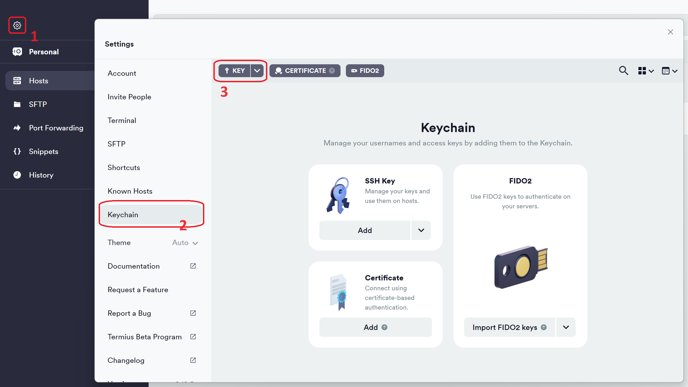
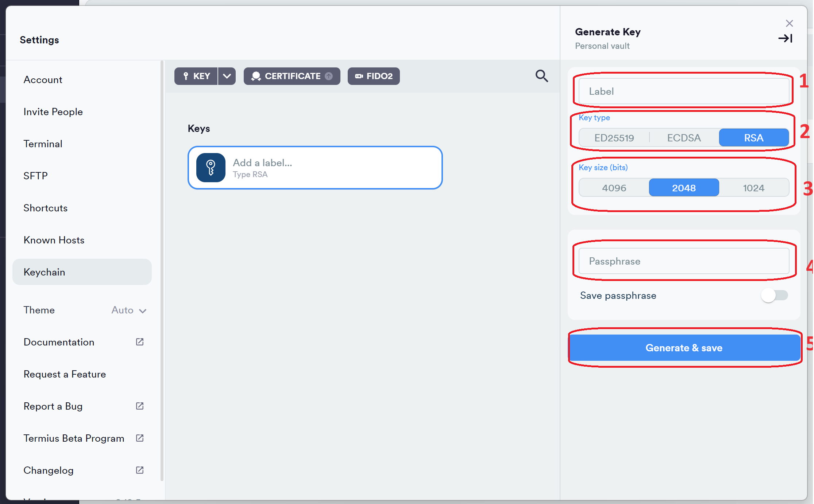
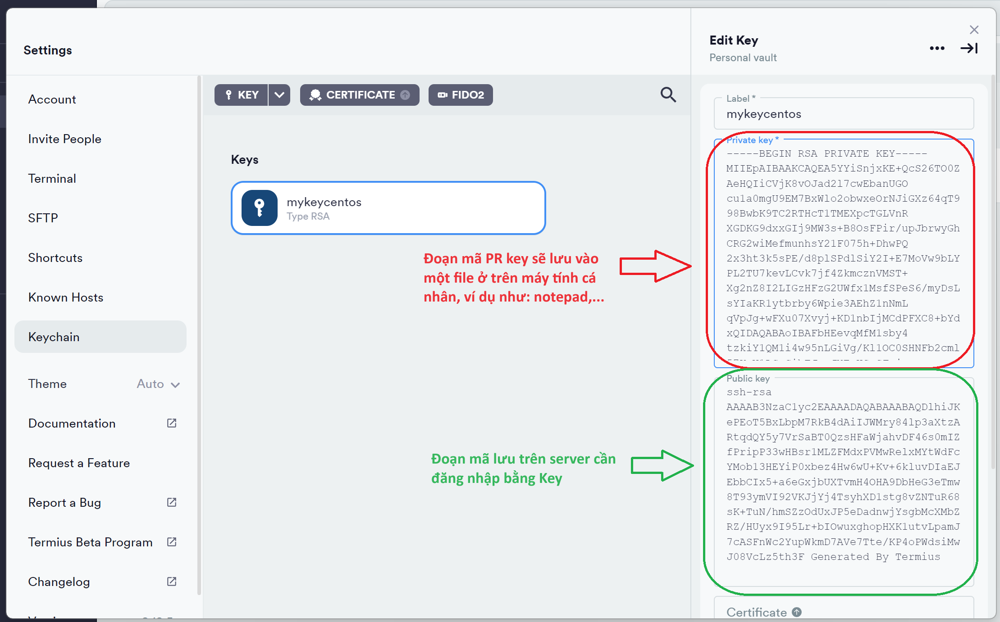
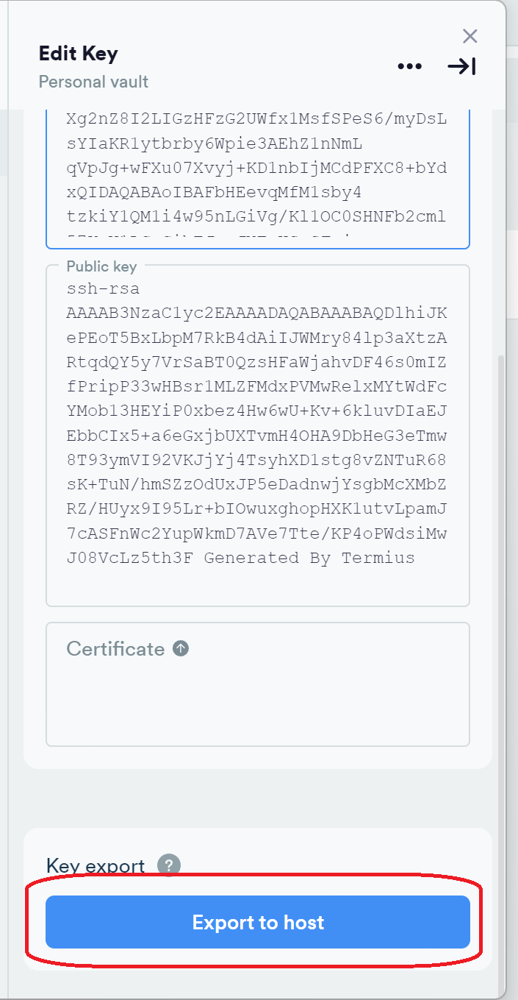
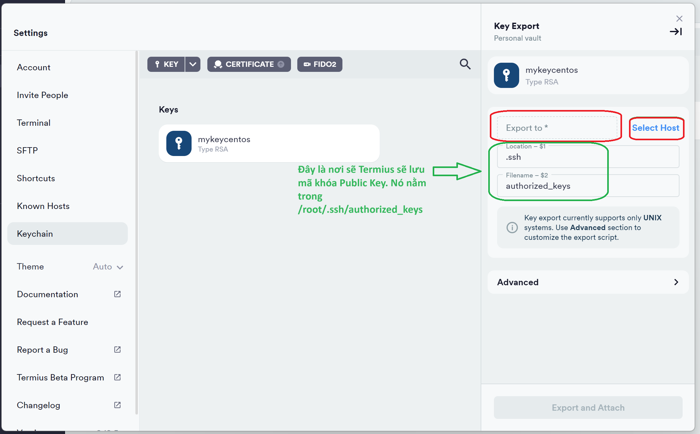
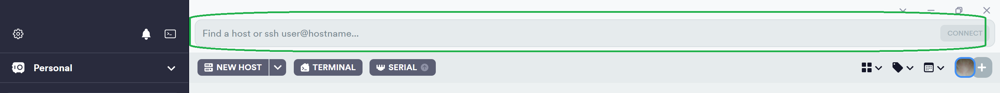
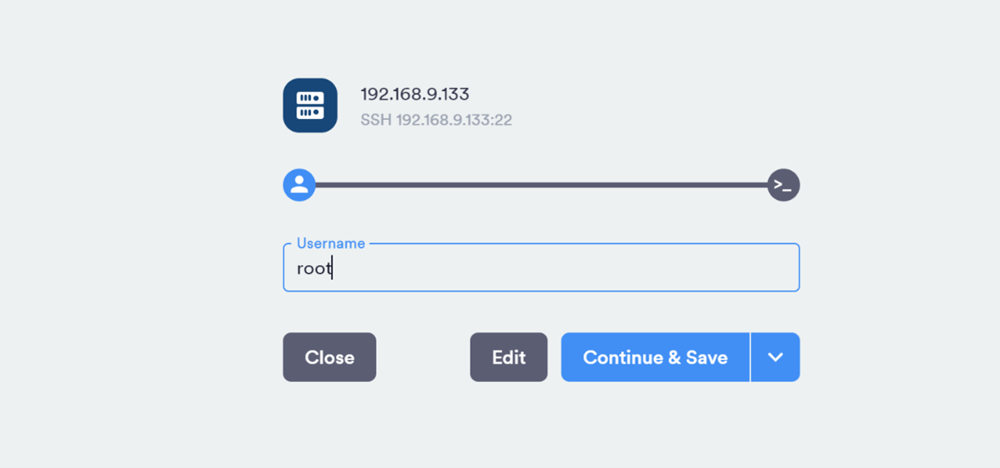
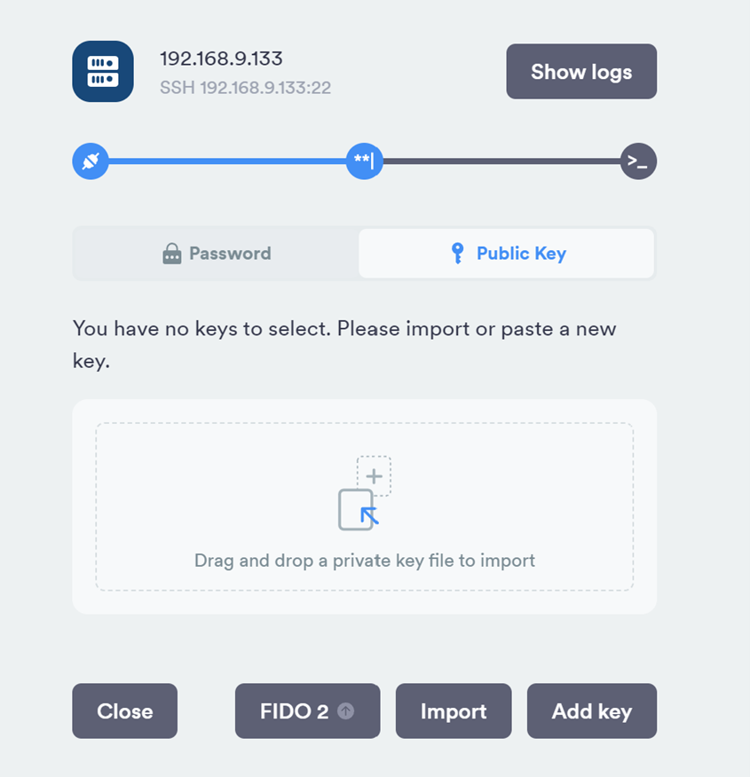
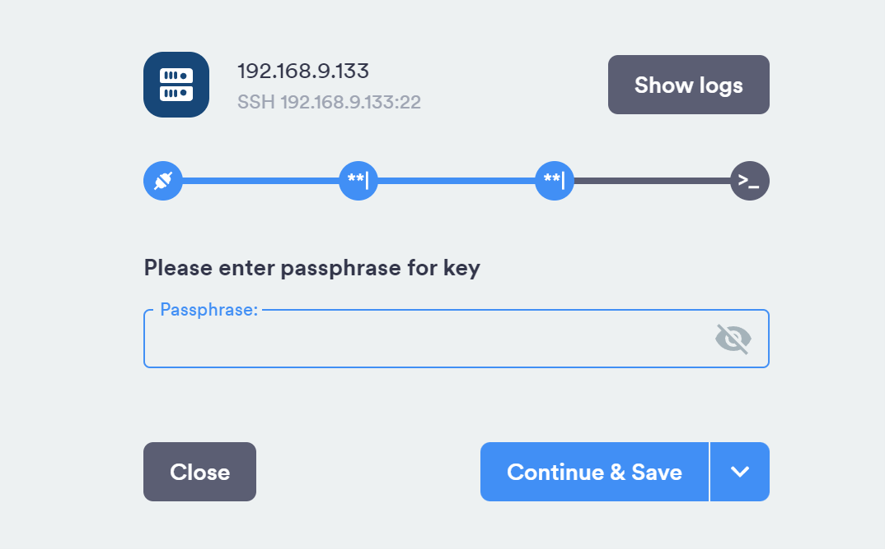
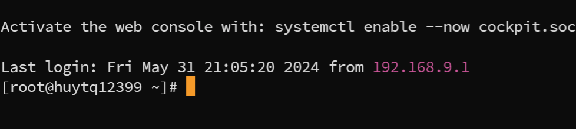

# Hướng dẫn SSH bằng Key khi đăng nhập Termius trên Windows

## 1. SSH key là gì?

- SSH key có thể hiểu đơn giản là một kiểu xác thực đối chiếu giữa người dùng (Private Key) và Server/VPS (Public key).

- Ta có thể coi Private Key như là chìa khóa, còn Public Key đóng vai trò là ổ khóa.

## 2. Lợi ích của việc sử dụng SSH Key

Thông thường một người dùng đăng nhập VPS thông qua username root và password của user đó. Người dùng có thể mất quyền truy cập vào VPS nếu bị quên hoặc để lộ mật khẩu hay bị dò tìm mật khẩu bởi Brute Force Attack. Do đó việc sử dụng SSH key đem lại khả năng bảo mật hơn rất nhiều so với việc sử dụng mật khẩu truyền thống.

## 3. Các thành phần của SSH Key

SSH Key gồm 3 thành phần sau:

- `Public Key`: Lưu trữ tại Server đóng vai trò làm ổ khóa. Lưu tại file `/root/.ssh/authorized_keys` trên Server.

- `Private Key`: Lưu trữ tại máy tính cá nhận, đóng vai trò làm chìa khóa.

- `Keypharse`: Mật khẩu để mở Private Key. Nếu ta đặt mật khẩu cho Private Key thì khi SSH vào Server sẽ cần nhập Keypharse để có thể kết nối.

## 4. Nguyên tắc hoạt động của SSH Key

- Private Key và Public Key luôn có liên hệ chặt chẽ với nhau để có thể nhận diện lẫn nhau. Khi tạo một SSH Key, người dùng sẽ có 1 cặp khóa Public-Private. Sau đó, người dùng tiến hành tải Public Key lên máy chủ của mình. Còn Private Key sẽ lưu ở máy tính cá nhân.

- Khi đăng nhập vào Server, người dùng sẽ gửi yêu cầu đăng nhập kèm theo Private Key lưu tại máy tính cá nhân đến Server. Server sẽ kiểm tra xem Private Key của người dùng có khớp với Public Key có trên Server hay không, nếu khớp thì bạn sẽ đăng nhập thành công.

## 5. Cách tạo SSH Key trong Termius trên hệ điều hành Windows

- B1: 

	+ Mở Termius.

	+ Click vào biểu tượng `Setting` góc trái phía trên màn hình. 

	+ Chọn `Keychain`.
	
	+ Trỏ vào phần mũi tên xuống cạnh `Key` => chọn `Generate Key`.

- B2: 

	+ Điền tên khóa vào `Label`. 

	+ Chọn `Key type`, ở đây chọn `RSA`.

	+ Chọn `Key size`, ở đây chọn `2048` bits.

	+ Phần `Passphrase`, đặt pass cho Private Key(tùy thích), nhưng lời khuyên nên điền để khi đăng nhập sẽ bắt nhập mật khẩu của file Private Key.
	
	+ Sau đó, ấn `Generate & save`.

- B3: 

Nó sẽ tạo ra đoạn mã ngẫu nhiên của cặp khóa Public-Private. Lưu lại đoạn mã Private Key vào một file nào đó, ví dụ như: notepad,…

Sau đó, ấn `Export to host`.

- B4: 

	+ Ta điền `địa chỉ IP` của Server vào trong ô hoặc Click vào phần `Select Host` ở bên cạnh để chọn Server đăng nhập bằng Key.

	+ Ở đây, khóa Public Key đã được Termius lưu trong `/root/.ssh/authorized_keys` của Server mà ta đã chọn ở phần `Host`.

	+ Sau đó, ấn `Export and Attach` để hoàn thành việc thiết lập.

## 6. SSH vào Server bằng Key

- B1:

Ta điền `Host` hoặc gõ `ssh username@hostname` muốn đăng nhập vào ô trống, sau đó ấn `Connect` để đăng nhập.

- B2:

Điền Username vào ô trống, sau đó ấn `Continue & Save` để tiếp tục.

- B3:
 

Ở đây ta chọn đăng nhập `Public Key`, sau đó `kéo và thả` file Private Key vào ô trống hoặc ấn `Import` file Private Key đã lưu trong máy tính cá nhân. 

Lưu ý, định dạng file Private key phải lưu ở đuôi `.ppk` thì mới hợp lệ.

- B4:

Nếu ta đặt mật khẩu cho Private Key khi thiết lập khóa ở `B2, mục 5 trước đó` thì sẽ phải điền để đăng nhập vào server. Sau đó, ấn “Continue & Save”. 
Còn không đặt mật khẩu cho khóa bí mật thì sẽ đăng nhập vào thẳng server.

- B5:

Kết quả,ta đã đăng nhập thành công vào Server bằng cặp khóa PB-PR Key trong Termius.

# 7. Kết luận

Như vậy, qua phần trình bày ở trên, tôi đã giới thiệu cho các bạn cách đăng nhập SSH bằng Key trong Termius trên hệ điều hành Windows.

